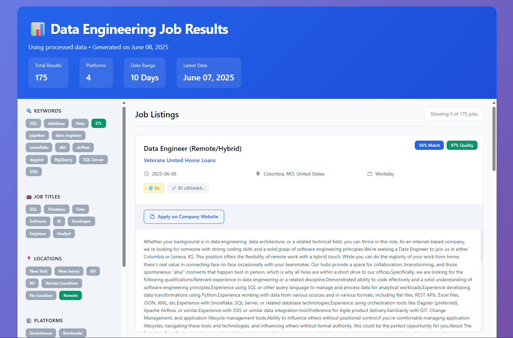
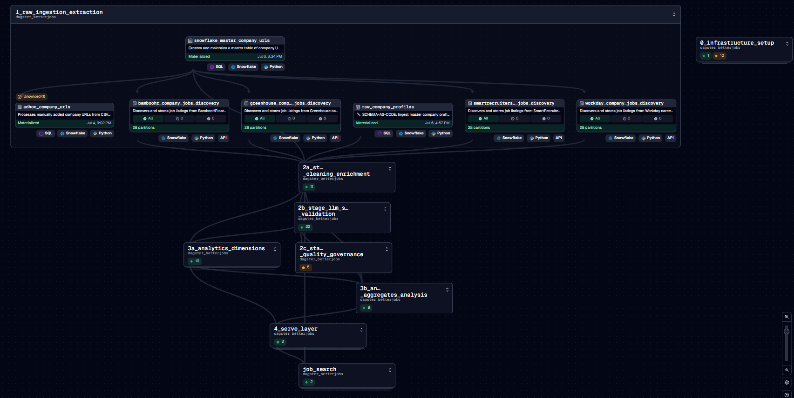
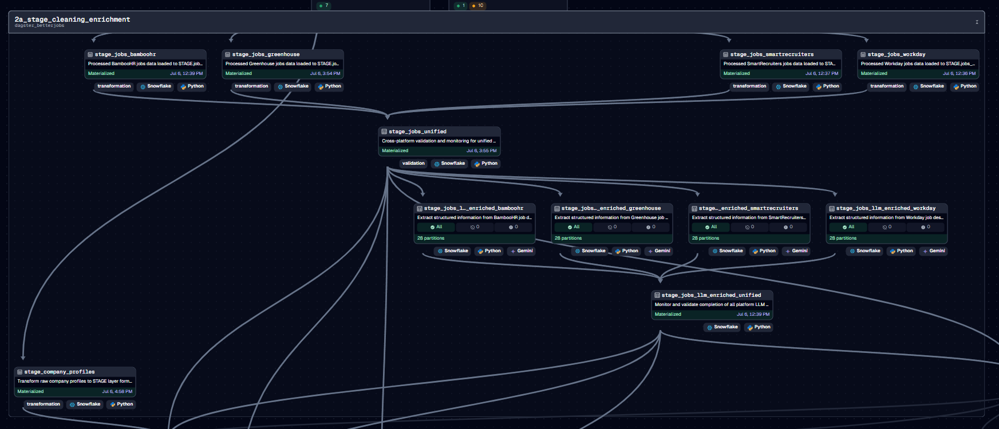
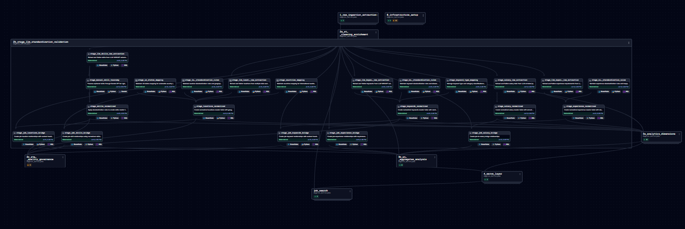
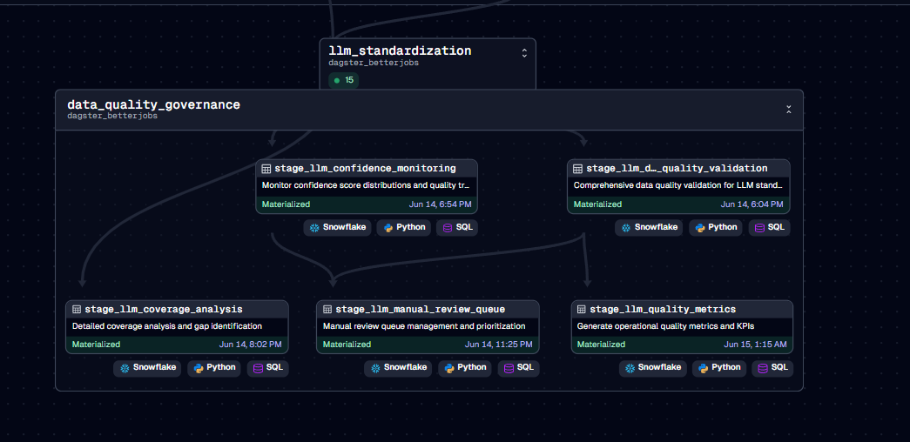
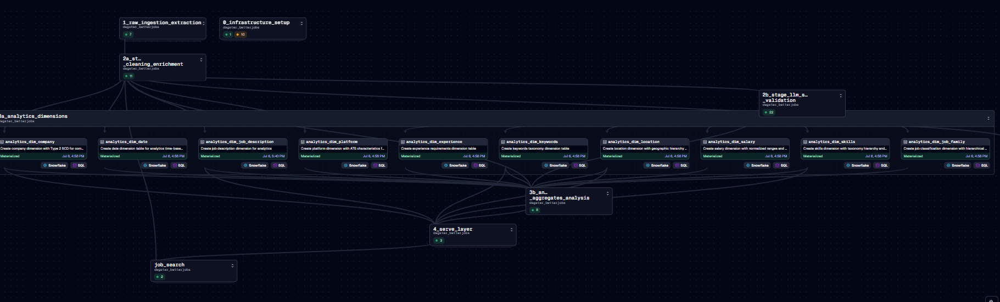
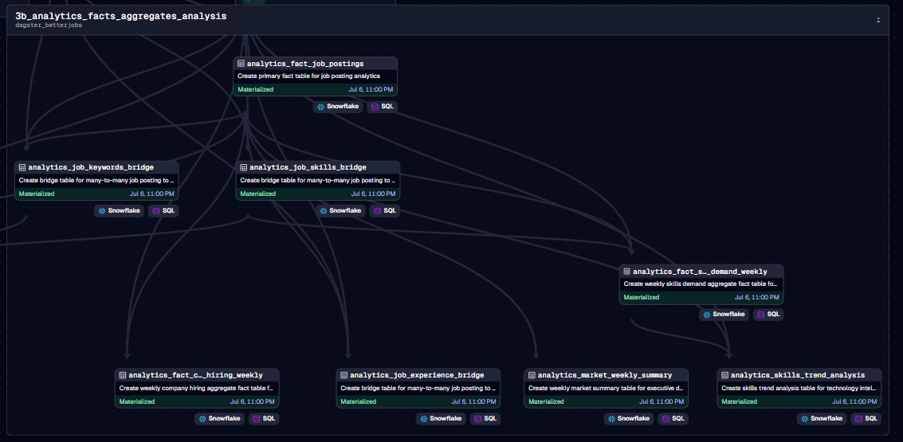
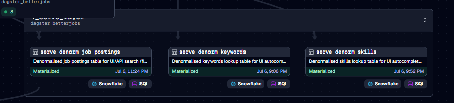
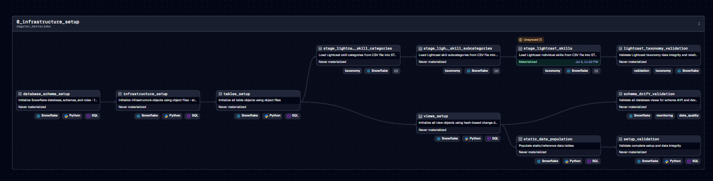

# BetterJobs-Snow

BetterJobs-Snow is a comprehensive job market analytics project that retrieves job postings directly from company career portals across various Applicant Tracking Systems (ATS) such as Workday, Greenhouse, BambooHR, and more. The goal of this project is to analyze the job market for trends, hiring patterns, and industry insights.

## ⚠️ Disclaimer

**This is a personal work in progress project.**

- This project is not officially supported
- Use at your own risk
- No warranty or support is provided
- The codebase may change significantly without notice
- Use responsibly and for personal research only

## Project Architecture

The project consists of a Dagster data pipeline implementing a medallion architecture (Bronze, Silver, Gold, Serve) for retrieving, processing, and storing job data in Snowflake for analytics and reporting.

### Data Flow Architecture

```
CSV Data Sources (Company URLs with verified ATS links)
         ↓
   CSV Ingestion (Bronze Layer)
         ↓
    Job Discovery Jobs
         ↓
   Data Transformation (Silver/Gold Layers)
         ↓
   Data Denormalization (Serve Layer)
         ↓
   Snowflake Storage
         ↓
Analytics & Reporting / Advanced Job Search
         ↓
  Business Intelligence / Applications
```

### Pipeline Components
- **CSV Ingestion**: Processes CSV files containing company information with verified ATS URLs from S3 and local sources
- **Adhoc Processing**: Sensor-based ingestion for additional CSV files as needed
- **Job Discovery**: Extracts job listings from company sites, varies by ATS platform
- **Data Transformation**: Medallion architecture layers for data quality and enrichment (Bronze → Silver → Gold → Serve)
- **Data Denormalization**: SERVE layer optimizes data for applications and advanced job search functionality
- **Data Storage**: Stores job and company data in Snowflake for analytics

**Note**: The initial CSV files with verified ATS URLs were generated from a previous version of this project that included automated URL discovery and extraction processes.

### Job Search & Reporting

The pipeline includes an advanced job search capability that generates modern, interactive HTML reports for analyzing job market data. The search functionality leverages the cleaned and enriched STAGE data to provide high-quality results with advanced filtering capabilities.

#### Features:
- **Interactive Filtering**: Client-side filtering by keywords, job titles, locations, and platforms
- **Quality Scoring**: Filter jobs by data quality scores and language detection confidence
- **Modern UI**: Responsive design with professional styling suitable for stakeholder presentations
- **Smart Deduplication**: Cross-platform duplicate removal ensures unique job listings
- **Shareable URLs**: Bookmark and share filtered search results with URL parameters




The job search reports show:
- **Header Stats**: Total results, platforms searched, date range, and data freshness
- **Filter Panel**: Interactive tags for keywords, job titles, locations, and platforms
- **Job Cards**: Clean, professional job listing cards with relevance and quality scores
- **Detailed Information**: Company details, posting dates, locations, and full job descriptions
- **AI-Powered Job Insights**: Extracted job insights such as salary range, experience required, technical skills, and more

### Dagster Pipeline Architecture (IN DEVELOPMENT)

The following diagrams show the current structure of our evolving Dagster pipeline, implementing a medallion architecture with parallel processing and AI-powered enrichment. **This is an active work in progress** with additional assets and a complete Gold layer coming soon.

#### RAW (Bronze) Layer  ✅ **PRODUCTION READY**


The RAW layer handles data ingestion and initial discovery:
- **Company URL Management**: Processes master company data from S3 and local sources
- **Parallel Job Discovery**: Individual platform assets for BambooHR, Greenhouse, Workday, and SmartRecruiters discovery
- **Company Profile Extraction**: Automated company information gathering
- **Sensor-Based Processing**: Adhoc company processing with automatic detection

#### STAGE (Silver) Layer  ✅ **PRODUCTION READY**


The STAGE layer provides comprehensive data transformation and AI enrichment:
- **Platform-Specific Processing**: Individual stage assets for each ATS platform enable parallel processing
- **Unified Data Integration**: Cross-platform validation and deduplication in `stage_jobs_unified`
- **AI-Powered Enrichment**: Parallel LLM processing for salary extraction, skills analysis, and job classification
- **Quality Validation**: Comprehensive data quality scoring and language detection
- **Enhanced Job Search**: Modern HTML report generation with interactive filtering capabilities

##### LLM Data Normalization & Standardization sub-layer ✅ **PRODUCTION READY**


The LLM Normalization & Standardization group transforms AI-extracted VARIANT/JSON data into normalized relational structures:
- **Skills Normalization** ✅ **COMPLETED**: Two-pass normalization using LIGHTCAST SKILL TAXONOMY to standardize LLM-enriched skills with canonical forms and family classification
- **Keywords Standardization** ✅ **COMPLETED**: Keywords normalized with industry and role type classifications for consistent terminology
- **Location Standardization** ✅ **COMPLETED**: Geographic hierarchy and tech hub classification with work arrangement context
- **Data Quality Validation** ✅ **COMPLETED**: Comprehensive quality monitoring, anomaly detection, and automated alerting
- **Analytics Enablement** ✅ **COMPLETED**: Pre-aggregated views and performance optimization for downstream analytics

##### Data Quality & Governance sub-layer ✅ **COMPLETED**


The Data Quality Governance group provides comprehensive monitoring and validation capabilities:
- **Quality Validation** ✅ **COMPLETED**: Cross-asset validation with 6 validation categories (referential integrity, completeness, consistency, accuracy, freshness, business logic)
- **Operational Metrics** ✅ **COMPLETED**: Real-time KPI tracking with GREEN/YELLOW/RED status indicators and trend analysis
- **Coverage Analysis** ✅ **COMPLETED**: Multi-dimensional coverage analysis by company size, salary range, and job characteristics
- **Confidence Monitoring** ✅ **COMPLETED**: Quality distribution monitoring with automated review queue prioritization
- **Manual Review Management** ✅ **COMPLETED**: Intelligent review queue with priority scoring and workflow automation

**Production Achievements:**
- **Phase 1-3 Complete**: Skills, keywords, and locations fully normalized with 97.8% job coverage
- **Phase 4 Complete**: Comprehensive data governance framework with automated quality monitoring
- **Quality Standards**: Need to achieve >90% quality score across all validation categories
- **Bridge Tables**: Many-to-many relationships with source tracking and context classification
- **Geographic Intelligence**: Enhanced location parsing with US states and international support

**Next Phase:**
- **Phase 5**: Analytics-optimized views and materialized tables for Gold layer integration

#### GOLD (Analytics) Layer ✅ **PRODUCTION READY**




The GOLD layer provides business-ready analytics and reporting with comprehensive dimensional modeling:

**Analytics Dimensions** ✅ **COMPLETED**:
- **Company Intelligence**: Company profiles with industry classification and hiring patterns
- **Date Intelligence**: Complete date dimension with business calendar support
- **Geographic Intelligence**: Location hierarchy with tech hub classification and remote work context
- **Job Family Intelligence**: Role classification with seniority and skill family mapping
- **Platform Intelligence**: ATS platform characteristics and coverage analysis
- **Skills Intelligence**: Comprehensive skills taxonomy with canonical forms and categories
- **Salary Intelligence**: Compensation benchmarking with confidence scoring

**Facts & Aggregates** ✅ **COMPLETED**:
- **Job Postings Fact Table**: Core analytical foundation with job records and dimensional relationships
- **Skills Demand Analytics**: Weekly skills trend analysis with market penetration and salary premiums
- **Company Hiring Intelligence**: Weekly company hiring patterns and competitive analysis
- **Market Summary Analytics**: Executive dashboard metrics with week-over-week growth tracking
- **Bridge Tables**: Many-to-many relationships for skills, keywords, and job experience mapping

#### SERVE (Application) Layer ✅ **PRODUCTION READY**


*Denormalized data optimized for application consumption*

The SERVE layer provides denormalized, application-ready data for external consumption:
- **Denormalized Job Postings**: Flattened job data with all related dimensions for fast application queries
- **Denormalized Keywords**: Optimized keyword lookup table for UI autocomplete and filtering
- **Denormalized Skills**: Skills lookup table with canonical forms for application integration
- **Advanced Job Search**: Optimized data structure supporting the interactive HTML job search reports
- **API-Ready Datasets**: Pre-aggregated and denormalized data for external applications and integrations
- **Performance Optimization**: Single-table queries eliminate complex joins for application use cases

#### Current Architecture Benefits:
- **Parallel Processing**: 4-5x performance improvement through platform-specific assets
- **Failure Isolation**: Individual platform failures don't affect others
- **Resilient Processing**: Individual record error handling prevents batch failures
- **AI Integration**: Gemini LLM extraction for structured job information
- **Production Ready**: Comprehensive monitoring, error tracking, and quality validation

#### Upcoming Enhancements:
- **Additional ATS Platforms**: Lever, Jobvite, iCIMS integration
- **Advanced Analytics**: Predictive hiring models and market forecasting
- **API Endpoints**: External access to processed job market data

### Analytics & Reporting
- **Job Market Trends**: Track hiring patterns across industries and companies
- **Company Analysis**: Monitor job posting frequency and patterns by company
- **Geographic Distribution**: Analyze job opportunities by location
- **Skills & Requirements**: Extract insights from job descriptions and requirements

## Getting Started

Follow these steps to get the BetterJobs project running locally:

### Step 1: Prerequisites

Ensure you have the following installed:
- **Python 3.10+**
- **Git**
- **AWS Account** (for S3 integration)
- **Snowflake Account** (with ACCOUNTADMIN privileges for initial setup)
- **Google AI Studio Account** (for LLM features)

### Step 2: Clone and Install

1. **Clone the repository**:
```bash
git clone [repository URL]
cd betterjobs-snow
```

2. **Install the Dagster pipeline**:
```bash
cd pipeline/dagster_betterjobs
pip install -e .
```

### Step 3: Environment Configuration

1. **Rename the environment template .env.exampleunder `pipeline/dagster_betterjobs` to .env**:


2. **Edit the .env file** with your credentials:
   - **Snowflake**: Account, username, password, and warehouse details
   - **AWS S3**: Access key, secret key, region, and bucket information
   - **LLM APIs**: Gemini API key (and OpenAI if using)
   - **Database settings**: Keep the default database and schema names

### Step 4: Set Up External Services

#### AWS S3 Setup
Create your S3 bucket and IAM role before setting up Snowflake:
- Create an S3 bucket (e.g., `betterjobs-dagster`)
- Set up IAM role with S3 access permissions
- **For detailed instructions, see: [S3_SNOWFLAKE_SETUP.md](pipeline/docs/setup/S3_SNOWFLAKE_SETUP.md)**

### Step 5: Start the Pipeline

```bash
cd pipeline/dagster_betterjobs
dagster dev
```

#### Step 6: Snowflake Infrastructure Setup


Set up your complete Snowflake infrastructure using automated assets:
- **For complete setup instructions, see: [SNOWFLAKE_SETUP.md](pipeline/docs/setup/SNOWFLAKE_SETUP.md)**


The Dagster UI will be available at `http://localhost:3000`.


### Step 7: Verify Setup

Run the `setup_validation` asset to verify your infrastructure is properly configured.

🎉 **Your BetterJobs pipeline is now ready!** You can start materializing data assets and running job discovery workflows.

## Pipeline Jobs (OUTDATED - WILL BE UPDATED SOON)

The following Dagster jobs are available to run:


- **Master Company URLs Job**:
  - `snowflake_master_company_urls_job`: Process and maintain master company URLs in Snowflake from S3 and local CSV sources

- **Job Position Discovery Jobs**:
  - `bamboohr_jobs_discovery_job`: Find BambooHR jobs
  - `greenhouse_jobs_discovery_job`: Find Greenhouse jobs
  - `workday_jobs_discovery_job`: Find Workday jobs
  - `smartrecruiters_jobs_discovery_job`: Find SmartRecruiters jobs

- **Data Engineering Jobs**:
  - `data_engineering_job`: Run job search for data engineering positions

- **End-to-End Jobs**:
  - `full_jobs_discovery_and_search_job`: Run all job discovery, and data_engineering job


See the Dagster UI for the complete list of available jobs and their descriptions.

## Usage Workflow

### Adding Company Data Sources (OUTDATED - WILL BE UPDATED SOON)

1. For each supported ATS platform, create or update a CSV file named `[ats-name]_companies.csv` under the `pipeline/dagster_betterjobs/dagster_betterjobs/data_load/datasource` directory with the following headers:

```
company_name,company_industry,employee_count_range,city,platform
```

Example for Workday:
```
company_name,company_industry,employee_count_range,city,platform
Acme Corp,Technology,1001-5000,San Francisco,workday
Widget Inc,Manufacturing,5001-10000,Chicago,workday
```

Supported platforms include:
- workday
- greenhouse
- bamboohr
- smartrecruiters
- lever (job discovery not implemented yet)
- jobvite (job discovery not implemented yet)
- icims (job discovery not properly implemented yet. The response from icims sites is a bit on the complex site. Will revisit in the future)


### Asset Materialization Workflows (OUTDATED - WILL BE UPDATED SOON)

There are two main approaches to running the pipeline:

#### Option 1: Full Asset Materialization

To materialize all assets in the pipeline:

```bash
cd pipeline/dagster_betterjobs
python -m dagster asset materialize
```

This approach is useful for initial setup or when adding many new companies.

#### Option 2: Adhoc Company Processing

For quickly adding or updating specific companies:

1. Materialize the snowflake_master_company_urls asset:
```bash
cd pipeline/dagster_betterjobs
python -m dagster asset materialize -a snowflake_master_company_urls
```

2. Add company entries to `pipeline/dagster_betterjobs/input/adhoc_companies.csv` with the following format:
```
company_name,company_industry,platform,ats_url,career_url,url_verified
Acme Corp,Technology,workday,https://acme.wd1.myworkdayjobs.com/acme_careers/,https://www.acme.com/careers,True
```

3. The adhoc_company_urls_sensor will automatically detect changes to this file and trigger the relevant job discovery pipelines.

### Scheduling Jobs (OUTDATED - WILL BE UPDATED SOON)

For automated use, you should configure appropriate schedules:

1. The snowflake_master_company_urls_job only needs to run when you update the datasource CSV files with new companies.

2. The job discovery assets need to run frequently to find new job postings.

To modify the built-in schedules or create new ones:

1. Edit `pipeline/dagster_betterjobs/dagster_betterjobs/schedules.py` to adjust:
   - Run frequency (cron schedule)
   - Assets to materialize
   - Execution parameters

Example configuration:
```python
@schedule(
    cron_schedule="0 */4 * * *",  # Every 4 hours
    job=data_engineering_job,
    execution_timezone="America/New_York",
)
def jobs_every_four_hours_schedule():
    return RunRequest(
        run_key=None,
        run_config={},
        tags={"schedule": "jobs_every_four_hours"},
    )
```

2. Add your new schedule to the `definitions.py` file in the schedules list.

3. When running Dagster, your schedule will appear in the UI where you can turn it on.

### Best Practices for Resource Usage (OUTDATED - WILL BE UPDATED SOON)

- Snowflake master company urls job should be run when you update the CSV files with new companies on S3 or locally
- Job discovery jobs should be run daily
- Some ATS platforms have rate limits - avoid running jobs too frequently
- The rest of the pipeline is intended to be run weekly for market analysis and reporting but can be run daily as needed

## Data Analytics & Reporting (OUTDATED - WILL BE UPDATED SOON)


### Business Intelligence Integration

The Snowflake data warehouse can be connected to various BI tools:

- **Tableau**: Connect directly to Snowflake for interactive dashboards
- **Power BI**: Use Snowflake connector for real-time reporting
- **Looker**: Create data models and exploration interfaces
- **Metabase**: Create data models and exploration interfaces

## Features

- **Efficient Job Discovery**: Find jobs faster than traditional job search engines
- **Multi-platform Coverage**: Support for major ATS platforms (Workday, Greenhouse, BambooHR, etc.)
- **Comprehensive Analytics**: Track job market trends, company hiring patterns, and industry insights
- **Scalable Architecture**: Handle large volumes of job data with Snowflake's cloud data platform and Gemini AI
- **Automated Processing**: Schedule regular job discovery and data updates
- **Data Quality**: Built-in validation and deduplication of job listings

## Migration Notes

This project has been migrated from BigQuery to Snowflake as a personal experiment to compare the performance and capabilities of the two platforms. It will be migrated again to BigQuery with the hope of making it compatible with both platforms with minimal feature disparity.


## Contributing

This is a personal project and not actively seeking contributions. However, feel free to fork the repository if you find it useful.

## License

This project is licensed under the MIT License - see the LICENSE file for details.

---

Built as a personal project for exploring job market data and modern data engineering technologies.
