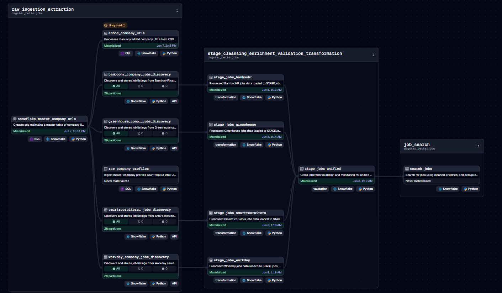

# BetterJobs-Snow

BetterJobs-Snow is a comprehensive job market analytics project that retrieves job postings directly from company career portals across various Applicant Tracking Systems (ATS) such as Workday, Greenhouse, BambooHR, and more. The goal of this project is to analyze the job market for trends, hiring patterns, and industry insights.

## ⚠️ Disclaimer

**This is a personal work in progress project.**

- This project is not officially supported
- Use at your own risk
- No warranty or support is provided
- The codebase may change significantly without notice
- Use responsibly and for personal research only

## Project Architecture

The project consists of a Dagster data pipeline implementing a medallion architecture (Bronze, Silver, Gold) for retrieving, processing, and storing job data in Snowflake for analytics and reporting.

### Data Flow Architecture

```
CSV Data Sources (Company URLs with verified ATS links)
         ↓
   CSV Ingestion (Bronze Layer)
         ↓
    Job Discovery Jobs
         ↓
   Data Transformation (Silver/Gold Layers)
         ↓
   Snowflake Storage
         ↓
Analytics & Reporting
         ↓
  Business Intelligence
```

### Pipeline Components
- **CSV Ingestion**: Processes CSV files containing company information with verified ATS URLs from S3 and local sources
- **Adhoc Processing**: Sensor-based ingestion for additional CSV files as needed
- **Job Discovery**: Extracts job listings from company sites, varies by ATS platform
- **Data Transformation**: Medallion architecture layers for data quality and enrichment (Bronze → Silver → Gold)
- **Data Storage**: Stores job and company data in Snowflake for analytics

**Note**: The initial CSV files with verified ATS URLs were generated from a previous version of this project that included automated URL discovery and extraction processes.

### Dagster Pipeline Visualization (OUTDATED)

The following diagram shows the structure of our Dagster pipeline assets, including URL discovery, job discovery, and data transport components:

NOTE: This is an outdated diagram. This section will be updated with the latest architecture once fully implemented



### Analytics & Reporting
- **Job Market Trends**: Track hiring patterns across industries and companies
- **Company Analysis**: Monitor job posting frequency and patterns by company
- **ATS Platform Insights**: Compare job posting volumes across different platforms
- **Geographic Distribution**: Analyze job opportunities by location
- **Skills & Requirements**: Extract insights from job descriptions and requirements

## Getting Started

### Prerequisites

- Python (v3.10+)
- Docker (optional, for containerized deployment)
- Dagster
- Access to the following external services:
  - Snowflake
  - AWS S3
  - Google AI Gemini API
  - OpenAI API (optional)

### External Service Setup

#### 1. Snowflake
- Create a Snowflake account and warehouse
- Create a database (e.g., `BETTERJOBS_DB`)
- Create schemas for raw data (`RAW`) and processed data (`PROCESSED`)
- Create a user with appropriate permissions
- Note your account identifier, warehouse, and database details

**For detailed Snowflake setup instructions, see: [SNOWFLAKE_SETUP.md](pipeline/docs/setup/SNOWFLAKE_SETUP.md)**

**For S3-Snowflake integration setup, see: [S3_SNOWFLAKE_SETUP.md](pipeline/docs/setup/S3_SNOWFLAKE_SETUP.md)**

#### 2. Gemini API
- Set up Google AI Studio account
- Generate an API key for Gemini

### Environment Configuration

Create a `.env` file in the project root with the following variables:

```
# Snowflake
SNOWFLAKE_ACCOUNT=your_account_identifier
SNOWFLAKE_USER=your_username
SNOWFLAKE_PASSWORD=your_password
SNOWFLAKE_DATABASE=BETTERJOBS_DB
SNOWFLAKE_RAW_SCHEMA=RAW
SNOWFLAKE_PROCESSED_SCHEMA=PROCESSED
SNOWFLAKE_WAREHOUSE=your_warehouse
SNOWFLAKE_ROLE=your_role

# AI APIs
GEMINI_API_KEY=your_gemini_api_key
OPENAI_API_KEY=your_openai_api_key
```

### Installation

1. Clone the repository
```bash
git clone [repository URL]
cd betterjobs
```

2. Set up the Dagster pipeline
```bash
cd pipeline/dagster_betterjobs
pip install -e .
```

The `setup.py` file includes all necessary dependencies including:
- Dagster and related packages
- Snowflake connector
- Web discovery tools (BeautifulSoup, lxml)
- Gemini AI integration

### Running the Pipeline

Start the Dagster pipeline:
```bash
cd pipeline/dagster_betterjobs
dagster dev
```

The Dagster UI will be available at `http://localhost:3000` where you can run jobs, materialize assets, and monitor the pipeline.

## Pipeline Jobs

The following Dagster jobs are available to run:

- **URL Discovery Jobs**:
  - `workday_url_discovery_job`: Discover Workday career URLs
  - `greenhouse_url_discovery_job`: Discover Greenhouse career URLs
  - `bamboohr_url_discovery_job`: Discover BambooHR career URLs
  - `smartrecruiters_url_discovery_job`: Discover SmartRecruiters career URLs
  - And others (lever, jobvite, icims)

- **Job Position Discovery Jobs**:
  - `bamboohr_jobs_discovery_job`: Find BambooHR jobs
  - `greenhouse_jobs_discovery_job`: Find Greenhouse jobs
  - `workday_jobs_discovery_job`: Find Workday jobs
  - `smartrecruiters_jobs_discovery_job`: Find SmartRecruiters jobs

- **End-to-End Jobs**:
  - `full_jobs_discovery_and_search_job`: Run all URL discovery, job discovery, and data enrichment

See the Dagster UI for the complete list of available jobs and their descriptions.

## Usage Workflow

### Adding Company Data Sources

1. For each supported ATS platform, create or update a CSV file named `[ats-name]_companies.csv` under the `pipeline/dagster_betterjobs/dagster_betterjobs/data_load/datasource` directory with the following headers:

```
company_name,company_industry,employee_count_range,city,platform
```

Example for Workday:
```
company_name,company_industry,employee_count_range,city,platform
Acme Corp,Technology,1001-5000,San Francisco,workday
Widget Inc,Manufacturing,5001-10000,Chicago,workday
```

Supported platforms include:
- workday
- greenhouse
- bamboohr
- smartrecruiters
- lever (job discovery not implemented yet)
- jobvite (job discovery not implemented yet)
- icims (job discovery not properly implemented yet)

2. After updating CSV files, you need to run the relevant URL discovery jobs to detect the career sites for these companies.

### Asset Materialization Workflows

There are two main approaches to running the pipeline:

#### Option 1: Full Asset Materialization

To materialize all assets in the pipeline, including URL discovery and job discovery:

```bash
cd pipeline/dagster_betterjobs
python -m dagster asset materialize
```

This approach is useful for initial setup or when adding many new companies.

#### Option 2: Adhoc Company Processing

For quickly adding or updating specific companies:

1. Materialize the snowflake_master_company_urls asset:
```bash
cd pipeline/dagster_betterjobs
python -m dagster asset materialize -a snowflake_master_company_urls
```

2. Add company entries to `pipeline/dagster_betterjobs/input/adhoc_companies.csv` with the following format:
```
company_name,company_industry,platform,ats_url,career_url,url_verified
Acme Corp,Technology,workday,https://acme.wd1.myworkdayjobs.com/acme_careers/,https://www.acme.com/careers,True
```

3. The adhoc_company_urls_sensor will automatically detect changes to this file and trigger the relevant job discovery pipelines.

### Scheduling Jobs

For automated use, you should configure appropriate schedules:

1. The URL discovery assets (`*_company_urls`) only need to run when you update the datasource CSV files with new companies.

2. The job discovery assets need to run frequently to find new job postings.

To modify the built-in schedules or create new ones:

1. Edit `pipeline/dagster_betterjobs/dagster_betterjobs/schedules.py` to adjust:
   - Run frequency (cron schedule)
   - Assets to materialize
   - Execution parameters

Example configuration:
```python
@schedule(
    cron_schedule="0 */4 * * *",  # Every 4 hours
    job=data_engineering_job,
    execution_timezone="America/New_York",
)
def jobs_every_four_hours_schedule():
    return RunRequest(
        run_key=None,
        run_config={},
        tags={"schedule": "jobs_every_four_hours"},
    )
```

2. Add your new schedule to the `definitions.py` file in the schedules list.

3. When running Dagster, your schedule will appear in the UI where you can turn it on.

### Best Practices for Resource Usage

- URL discovery jobs should be run less frequently (monthly)
- Job discovery jobs should be run more frequently (daily or multiple times daily)
- To conserve resources, focus on platforms with high job turnover
- Some ATS platforms have rate limits - avoid running jobs too frequently

## Data Analytics & Reporting

### Snowflake Tables

The pipeline creates and maintains several key tables in Snowflake:

- **master_company_urls**: Company information and career site URLs
- **workday_jobs**: Job listings from Workday platforms
- **greenhouse_jobs**: Job listings from Greenhouse platforms
- **bamboohr_jobs**: Job listings from BambooHR platforms
- **smartrecruiters_jobs**: Job listings from SmartRecruiters platforms

### Sample Analytics Queries

**Job Posting Trends by Platform:**
```sql
SELECT
    platform,
    DATE_TRUNC('week', date_posted) as week,
    COUNT(*) as jobs_posted
FROM (
    SELECT 'workday' as platform, date_posted FROM workday_jobs WHERE is_active = TRUE
    UNION ALL
    SELECT 'greenhouse' as platform, date_posted FROM greenhouse_jobs WHERE is_active = TRUE
    UNION ALL
    SELECT 'bamboohr' as platform, date_posted FROM bamboohr_jobs WHERE is_active = TRUE
)
GROUP BY platform, week
ORDER BY week DESC;
```

**Top Companies by Job Volume:**
```sql
SELECT
    c.company_name,
    c.company_industry,
    COUNT(*) as total_jobs
FROM master_company_urls c
JOIN workday_jobs j ON c.company_id = j.company_id
WHERE j.is_active = TRUE
GROUP BY c.company_name, c.company_industry
ORDER BY total_jobs DESC
LIMIT 20;
```

### Business Intelligence Integration

The Snowflake data warehouse can be connected to various BI tools:

- **Tableau**: Connect directly to Snowflake for interactive dashboards
- **Power BI**: Use Snowflake connector for real-time reporting
- **Looker**: Create data models and exploration interfaces
- **Databricks**: For advanced analytics and machine learning
- **dbt**: For data transformation and modeling

## Features

- **Real-time Job Discovery**: Find jobs as soon as they're posted to company sites
- **Multi-platform Coverage**: Support for major ATS platforms (Workday, Greenhouse, BambooHR, etc.)
- **Comprehensive Analytics**: Track job market trends, company hiring patterns, and industry insights
- **Scalable Architecture**: Handle large volumes of job data with Snowflake's cloud data platform
- **Automated Processing**: Schedule regular job discovery and data updates
- **Data Quality**: Built-in validation and deduplication of job listings

## Migration Notes

This project has been migrated from BigQuery to Snowflake to provide:
- Better performance for analytics workloads
- More cost-effective data storage and compute
- Enhanced support for semi-structured data
- Improved integration with modern BI tools
- Better separation of compute and storage

## Contributing

This is a personal project and not actively seeking contributions. However, feel free to fork the repository if you find it useful.

## License

This project is licensed under the MIT License - see the LICENSE file for details.

---

Built as a personal project for exploring job market data and modern data engineering technologies.
