# Analytics Layer - Dimensional Model Entity Relationship Diagram

## Overview
This ERD represents the complete Analytics dimensional model for the job market intelligence platform. The model follows a star schema design with fact tables at the center connected to dimension tables, plus specialized aggregate tables for pre-calculated metrics.

## Entity Relationship Diagram

```mermaid
erDiagram
    %% === DIMENSION TABLES ===

    DIM_DATE {
        string date_key PK
        date full_date
        string day_name
        integer day_of_week
        date week_beginning_date
        date week_ending_date
        integer month_number
        string month_name
        integer quarter_number
        integer year_number
        boolean is_business_day
        boolean is_weekend
        timestamp created_timestamp
    }

    DIM_COMPANY {
        string company_key PK
        string company_id "Natural Key"
        string company_name
        string company_name_standardized
        string industry
        string employee_count_range
        string company_size_category
        string headquarters_location
        string funding_stage
        date effective_date "SCD2"
        date expiration_date "SCD2"
        boolean is_current "SCD2"
        integer version_number "SCD2"
        timestamp created_timestamp
        timestamp updated_timestamp
        string source_stage_table
    }

    DIM_LOCATION {
        string location_key PK
        string location_id "Natural Key"
        string location_name
        string city
        string state_province
        string country
        string region
        string metro_area
        string location_type
        boolean is_remote_friendly
        boolean is_major_tech_hub
        float cost_of_living_index
        float average_salary_adjustment
        float stage_confidence_score
        integer frequency_count
        timestamp created_timestamp
    }

    DIM_JOB_FAMILY {
        string job_family_key PK
        string job_family "Direct from LLM"
        string job_sub_family "Direct from LLM"
        string seniority_level "Direct from LLM"
        string role_type "Direct from LLM"
        integer seniority_order "Simple derivation"
        boolean is_management_role "Simple derivation"
        timestamp created_timestamp
    }

    DIM_SKILLS {
        string skill_key PK
        string skill_id "Natural Key"
        string skill_name
        string skill_category
        string skill_subcategory
        string canonical_form
        variant common_aliases
        variant original_variants
        float stage_confidence_score
        integer frequency_count
        string trend_direction
        timestamp created_timestamp
    }

    DIM_PLATFORM {
        string platform_key PK
        string platform_name
        string platform_code
        boolean supports_salary_disclosure
        float data_richness_score
        string job_volume_category
        boolean is_active
        timestamp created_timestamp
    }

    DIM_EXPERIENCE {
        string experience_key PK
        string experience_id "Natural Key"
        string experience_name
        string experience_category
        integer min_years_required
        integer max_years_required
        integer seniority_order
        string experience_description
        integer market_frequency
        float confidence_score
        timestamp created_timestamp
    }

    DIM_KEYWORDS {
        string keyword_key PK
        string keyword_id "Natural Key"
        string keyword_text
        string keyword_text_clean
        string keyword_type
        string keyword_category
        string canonical_form
        variant original_variants
        integer frequency_count
        float trend_score
        float confidence_score
        boolean approved_by_admin
        timestamp created_timestamp
    }

    DIM_SALARY {
        string salary_key PK
        string salary_id "Natural Key"
        string salary_range_name
        number salary_min_original "Audit Trail"
        number salary_max_original "Audit Trail"
        string salary_period_original "Audit Trail"
        string salary_currency_original "Audit Trail"
        number salary_min_annual_usd "Normalized Value"
        number salary_max_annual_usd "Normalized Value"
        number salary_midpoint_annual_usd "Normalized Value"
        float normalization_factor
        float confidence_score
        boolean outlier_flag
        boolean manual_review_flag
        boolean approved_by_admin
        integer frequency_count
        integer market_percentile
        timestamp created_timestamp
    }

    %% === MAIN FACT TABLE ===

    FACT_JOB_POSTINGS {
        string job_posting_key PK
        string date_posted_key FK
        string company_key FK
        string location_key FK
        string job_family_key FK
        string platform_key FK
        string keyword_key FK
        string salary_key FK
        string job_uid "Degenerate Dimension"
        string job_title "Degenerate Dimension"
        string posting_url "Degenerate Dimension"
        number salary_min_annual_usd "Normalized"
        number salary_max_annual_usd "Normalized"
        number salary_midpoint_annual_usd "Normalized"
        float salary_confidence
        float llm_overall_confidence
        float data_quality_score
        string job_family "Denormalized"
        string job_sub_family "Denormalized"
        string seniority_level "Denormalized"
        string work_type
        string remote_flexibility
        boolean is_active_posting
        boolean is_equity_mentioned
        boolean is_bonus_mentioned
        boolean llm_needs_manual_review
        date first_posted_date
        date date_retrieved
        timestamp created_timestamp
        timestamp updated_timestamp
        date partition_date "Partitioning Column"
    }

    %% === BRIDGE TABLES ===

    JOB_EXPERIENCE_BRIDGE {
        string experience_bridge_key PK
        string job_posting_key FK
        string experience_key FK
        float experience_weight
        boolean is_primary_requirement
        float extraction_confidence
        string technology_context
        string processing_method
        timestamp created_timestamp
    }

    %% === SPECIALIZED FACT TABLES ===

    FACT_SKILLS_DEMAND_WEEKLY {
        string skills_weekly_key PK
        string week_key
        string skill_key FK
        string job_family_key FK
        string location_key FK
        integer active_jobs_with_skill
        integer total_active_jobs
        float skill_penetration_rate
        number avg_salary_with_skill
        float salary_premium_percentage
        float week_over_week_change
        string trend_direction
        integer skill_rank_in_family
        integer skill_rank_overall
        timestamp created_timestamp
        date week_start_date "Partitioning Column"
    }

    FACT_COMPANY_HIRING_WEEKLY {
        string company_hiring_key PK
        string week_key
        string company_key FK
        integer jobs_posted_count
        integer active_jobs_count
        integer new_jobs_this_week
        float week_over_week_change
        string hiring_trend_direction
        number avg_salary_offered
        number median_salary_offered
        float salary_range_width
        float remote_jobs_percentage
        float hybrid_jobs_percentage
        float onsite_jobs_percentage
        float entry_level_percentage
        float senior_level_percentage
        float management_roles_percentage
        timestamp created_timestamp
        date week_start_date "Partitioning Column"
    }

    %% === AGGREGATE SUMMARY TABLES & VIEWS ===

    MARKET_WEEKLY_SUMMARY {
        string summary_key PK
        date week_ending_date
        string week_key
        integer total_jobs_posted
        integer total_active_jobs
        integer new_jobs_posted
        float week_over_week_growth_rate
        float posting_velocity_daily
        integer median_salary_all_roles
        integer avg_salary_all_roles
        float remote_work_percentage
        float hybrid_work_percentage
        float onsite_work_percentage
        integer sample_size
        float data_quality_score
        timestamp created_timestamp
    }

    SKILLS_TREND_ANALYSIS {
        string analysis_key PK
        date analysis_date
        string skill_key FK
        string week_key
        integer jobs_requiring_skill
        integer total_jobs_analyzed
        float market_penetration_rate
        integer demand_rank_overall
        float demand_growth_weekly
        float demand_growth_monthly
        integer rank_change_weekly
        integer rank_change_monthly
        number average_salary_with_skill
        float salary_premium_percentage
        float remote_availability_rate
        integer entry_level_demand
        integer mid_level_demand
        integer senior_level_demand
        integer sample_size
        float data_quality_score
        timestamp created_timestamp
    }

    COMPANY_HIRING_INTELLIGENCE {
        string intelligence_key PK "VIEW - Computed"
        date analysis_date "VIEW - Computed"
        string company_key FK "VIEW - Computed"
        string week_key "VIEW - Computed"
        integer jobs_posted_last_7_days "VIEW - Computed"
        integer jobs_posted_last_30_days "VIEW - Computed"
        integer current_job_postings "VIEW - Computed"
        string hiring_velocity_trend "VIEW - Computed"
        float week_over_week_growth_rate "VIEW - Computed"
        float salary_transparency_rate "VIEW - Computed"
        number avg_salary_offered "VIEW - Computed"
        float entry_vs_senior_ratio "VIEW - Computed"
        float technical_vs_business_ratio "VIEW - Computed"
        float remote_job_percentage "VIEW - Computed"
        string remote_work_policy "VIEW - Computed"
        integer hiring_rank_in_industry "VIEW - Computed"
        float hiring_competitiveness_score "VIEW - Computed"
        integer sample_size "VIEW - Computed"
        float data_completeness_score "VIEW - Computed"
        timestamp created_timestamp "VIEW - Computed"
    }

    %% === RELATIONSHIPS ===

    %% Main Fact Table Relationships
    FACT_JOB_POSTINGS ||--o{ DIM_DATE : "posted_on"
    FACT_JOB_POSTINGS ||--o{ DIM_COMPANY : "posted_by"
    FACT_JOB_POSTINGS ||--o{ DIM_LOCATION : "located_in"
    FACT_JOB_POSTINGS ||--o{ DIM_JOB_FAMILY : "categorized_as"
    FACT_JOB_POSTINGS ||--o{ DIM_PLATFORM : "sourced_from"
    FACT_JOB_POSTINGS ||--o{ DIM_KEYWORDS : "tagged_with_primary_keyword"
    FACT_JOB_POSTINGS ||--o{ DIM_SALARY : "offers_salary_range"

    %% Bridge table relationships
    FACT_JOB_POSTINGS ||--o{ JOB_EXPERIENCE_BRIDGE : "has_experience_requirements"
    JOB_EXPERIENCE_BRIDGE }o--|| DIM_EXPERIENCE : "maps_to_experience"

    %% Skills Fact Table Relationships
    FACT_SKILLS_DEMAND_WEEKLY ||--o{ DIM_SKILLS : "analyzes_skill"
    FACT_SKILLS_DEMAND_WEEKLY ||--o{ DIM_JOB_FAMILY : "within_family"
    FACT_SKILLS_DEMAND_WEEKLY ||--o{ DIM_LOCATION : "in_location"

    %% Company Fact Table Relationships
    FACT_COMPANY_HIRING_WEEKLY ||--o{ DIM_COMPANY : "analyzes_company"

    %% Aggregate Table Relationships
    SKILLS_TREND_ANALYSIS ||--o{ DIM_SKILLS : "trends_for_skill"
    COMPANY_HIRING_INTELLIGENCE ||--o{ DIM_COMPANY : "intelligence_for_company"

    %% View Relationships (computed from fact tables)
    FACT_COMPANY_HIRING_WEEKLY ||--o{ COMPANY_HIRING_INTELLIGENCE : "view_computes_from"

    %% Skills Bridge Relationship (Many-to-Many through STAGE layer)
    FACT_JOB_POSTINGS ||--o{ DIM_SKILLS : "requires_skills_via_bridge"

    %% Salary Bridge Relationship (Many-to-Many through STAGE layer)
    FACT_JOB_POSTINGS ||--o{ DIM_SALARY : "offers_salary_via_bridge"

    %% Keywords Bridge Relationship (Many-to-Many through STAGE layer)
    FACT_JOB_POSTINGS ||--o{ DIM_KEYWORDS : "tagged_with_keywords_via_bridge"
```

## Key Design Features

### Star Schema Architecture
- **Central Fact Table**: `FACT_JOB_POSTINGS` serves as the primary fact table containing individual job posting records
- **Dimension Tables**: Nine main dimensions providing context and hierarchy for analysis (Date, Company, Location, Job Family, Platform, Skills, Salary, Experience, Keywords)
- **Specialized Fact Tables**: Pre-aggregated tables for specific analytical domains (skills, company hiring)
- **Business Intelligence Views**: `COMPANY_HIRING_INTELLIGENCE` implemented as a view to eliminate redundancy while providing executive-ready metrics

### Data Granularity
- **Job Postings**: One record per unique job posting (natural grain)
- **Skills Demand**: Weekly aggregation by skill, job family, and location
- **Company Hiring**: Weekly aggregation by company
- **Market Summary**: Weekly market-level aggregation

### Key Relationships
1. **Job Postings ↔ Skills**: Many-to-many relationship through `STAGE.JOB_SKILLS_BRIDGE`
2. **Job Postings ↔ Salary**: Many-to-many relationship through `STAGE.JOB_SALARY_BRIDGE`
3. **Job Postings ↔ Experience**: Many-to-many relationship through `STAGE.JOB_EXPERIENCE_BRIDGE`
4. **Job Postings ↔ Keywords**: Many-to-many relationship through `STAGE.JOB_KEYWORDS_BRIDGE`
5. **Company SCD Type 2**: Historical tracking of company changes over time
6. **Time-based Partitioning**: All fact tables partitioned by date for performance

### Business Intelligence Features
- **Pre-calculated Metrics**: Aggregate tables for dashboard performance
- **Trend Analysis**: Week-over-week and month-over-month calculations
- **Market Intelligence**: Skills demand, salary analysis, and company hiring patterns
- **Salary Intelligence**: Normalized salary ranges, market percentiles, confidence scoring, and outlier detection with full audit trail
- **Experience Analytics**: Seniority level analysis, experience requirement trends, and career progression insights
- **Keyword Intelligence**: Job description analysis, industry terminology trends, and content categorization
- **Data Quality Tracking**: Confidence scores and completeness metrics throughout

### Performance Optimizations
- **Clustering**: Tables clustered on frequently-used filter columns
- **Partitioning**: Time-based partitioning for efficient querying
- **Denormalization**: Key attributes denormalized in fact tables for query performance